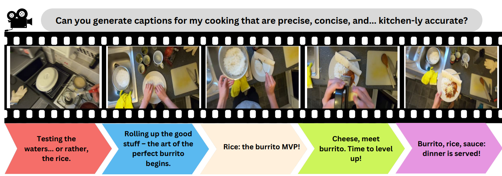
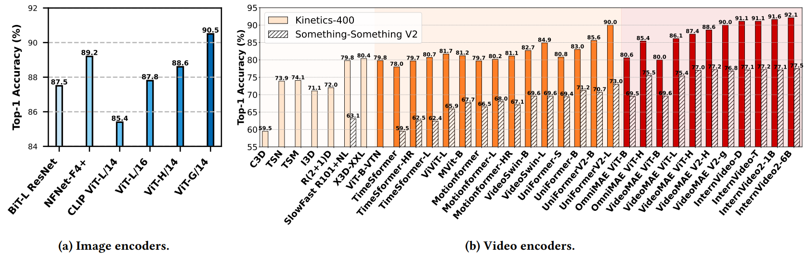
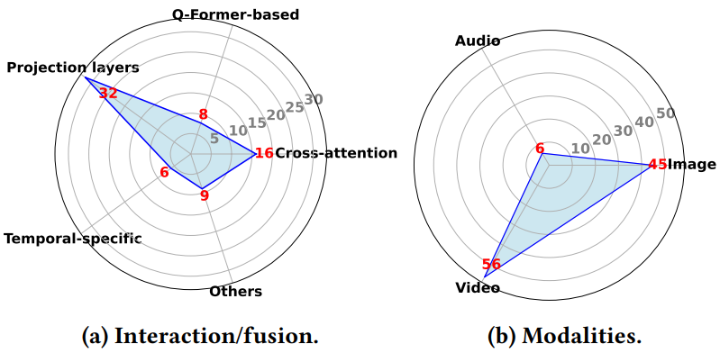
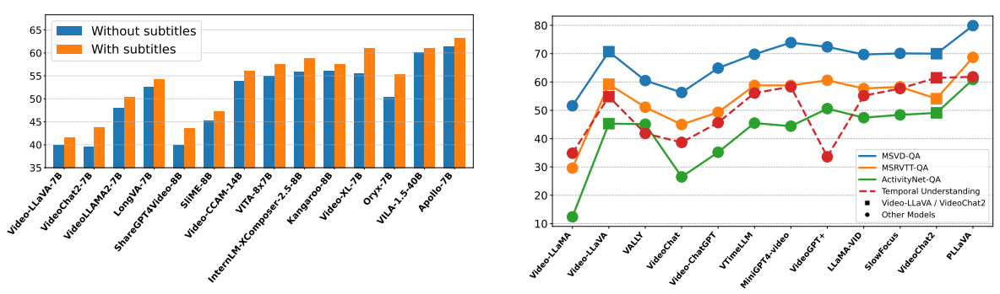
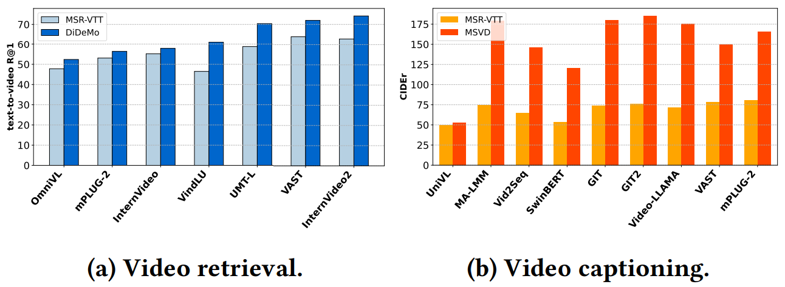

# Video-LLM

### 🔥🔥🔥[Do Language Models Understand Time?](https://arxiv.org/abs/2412.13845)🤔


Do language models understand time?🧐 In the kitchen arena🧑‍🍳, where burritos are rolled🌯, rice waits patiently🍚, and sauce steals the spotlight, LLMs try their best to keep up. Captions flow like a recipe—precise and tempting—but can they truly tell the difference between prepping, cooking, and eating? After all, in cooking, timing isn’t just everything—it’s the secret sauce!🥳🥳🥳
>
> 👋👋👋 A collection of papers and resources related to Large Language Models in video domain🎞️. 
>
> 📌 More details please refer to our [paper](https://arxiv.org/abs/2412.13845). 
>
> 🛠️ Please let us know if you find out a mistake or have any suggestions by e-mail: Xi.Ding1@anu.edu.au

### 📑 Citation

If you find our work useful for your research, please cite the following paper:

```bibtex
@inproceedings{ding2024language,
author={Ding, Xi and Wang, Lei},
title={Do Language Models Understand Time?},
year={2024},
publisher = {Association for Computing Machinery},
address = {New York, NY, USA},
abstract = {Large language models (LLMs) have revolutionized video-based computer vision applications, including action recognition, anomaly detection, and video summarization. Videos inherently pose unique challenges, combining spatial complexity with temporal dynamics that are absent in static images or textual data. Current approaches to video understanding with LLMs often rely on pretrained video encoders to extract spatiotemporal features and text encoders to capture semantic meaning. These representations are integrated within LLM frameworks, enabling multimodal reasoning across diverse video tasks. However, the critical question persists: Can LLMs truly understand the concept of time, and how effectively can they reason about temporal relationships in videos? This work critically examines the role of LLMs in video processing, with a specific focus on their temporal reasoning capabilities. We identify key limitations in the interaction between LLMs and pretrained encoders, revealing gaps in their ability to model long-term dependencies and abstract temporal concepts such as causality and event progression. Furthermore, we analyze challenges posed by existing video datasets, including biases, lack of temporal annotations, and domain-specific limitations that constrain the temporal understanding of LLMs. To address these gaps, we explore promising future directions, including the co-evolution of LLMs and encoders, the development of enriched datasets with explicit temporal labels, and innovative architectures for integrating spatial, temporal, and semantic reasoning. By addressing these challenges, we aim to advance the temporal comprehension of LLMs, unlocking their full potential in video analysis and beyond.},
booktitle = {Companion Proceedings of the ACM Web Conference 2025},
keywords = {Language language models, Videos, Temporal, Interaction},
location = {Sydney, NSW, Australia},
series = {WWW '25 Companion}
}
```

---

## 🚀 News
- \[27/01/2025\] 🎈Our paper has been accepted as an oral presentation at the Companion Proceedings of The Web Conference 2025 (WWW 2025)
- \[27/12/2024\] 🎁The GitHub repository for our paper has been released.

## 🔦 Table of Contents

- [Video-LLM](#video-llm)
  - [🔥🔥🔥 Do Language Models Understand Time?](#-do-language-models-understand-time)
  - [📑 Citation](#-citation)
  - [🚀 News](#-news)
  - [📸 Models with Image Encoder](#-models-with-image-encoder)
    - [Normalizer-Free ResNet](#normalizer-free-resnet)
    - [CLIP ViT](#clip-vit)
    - [EVA-CLIP ViT](#eva-clip-vit)
    - [BLIP-2 ViT](#blip-2-vit)
    - [SigLIP](#siglip)
    - [Oryx ViT](#oryx-vit)
  - [🎥 Models with Video Encoder](#-models-with-video-encoder)
    - [Traditional (e.g., I3D, SlowFast)](#traditional-eg-i3d-slowfast)
    - [TimeSformer](#timesformer)
    - [VideoSwin](#videoswin)
    - [UMT](#umt)
    - [LanguageBind](#languagebind)
    - [VideoMAE V2](#videomae-v2)
    - [InternVL](#internvl)
    - [InternVideo/InternVideo2](#internvideointernvideo2)
  - [💻 Datasets](#-datasets)
    - [Action Recognition](#action-recognition)
    - [Video QA](#video-qa)
    - [Video Captioning](#video-captioning)
    - [Video Retrieval](#video-retrieval)
    - [Anomaly Detection](#anomaly-detection)
    - [Multimodal Video Tasks](#multimodal-video-tasks)
  - [❤️‍🔥❤️‍🔥❤️‍🔥 Contribution](#️‍🔥️‍🔥️‍🔥-contribution)

---

Performance comparison of visual encoders. (Left): Image classification accuracy for various image encoders pretrained and fine-tuned on the ImageNet-1K dataset. (Right): Action recognition accuracy for different video encoders pretrained and fine-tuned on the Kinetics-400 and Something-Something V2 datasets.

## 📸 Models with Image Encoder
> ✨ The tables below present summaries of the latest multimodal video-LLMs with image encoders and their interaction and fusion mechanisms.

### Normalizer-Free ResNet

<details>
<summary>Click to expand Table 1</summary>

| Model          | Venue        | Other modality encoders               | Interaction / Fusion mechanism                    | Description                                     | Code |
|----------------|--------------|---------------------------------------|--------------------------------------------------|-------------------------------------------------|------|
| [Flamingo](https://arxiv.org/abs/2204.14198)       | NeurIPS 2022 | Text: Chinchilla                     | Perceiver Resampler & Gated XATTN-DENSE          | Visual-language model.   |   [Github](https://github.com/mlfoundations/open_flamingo)   |

</details>

### CLIP ViT

<details>
<summary>Click to expand Table 2</summary>

| Model          | Venue        | Other modality encoders               | Interaction / Fusion mechanism                    | Description                                     | Code |
|----------------|--------------|---------------------------------------|--------------------------------------------------|-------------------------------------------------|------|
| [mPLUG-2](https://arxiv.org/abs/2302.00402)        | ICML 2023    | Text: BERT                           | Universal layers & cross-attention modules       | Modularized multi-modal foundation model.      |   [GitHub](https://github.com/alibaba/AliceMind/tree/main/mPLUG)   |
| [Vid2Seq](https://arxiv.org/abs/2302.14115)        | CVPR 2023    | Text: T5-Base                        | Cross-modal attention                             | Sequence-to-sequence video-language model.     |  [GitHub](https://github.com/google-research/scenic/tree/main/scenic/projects/vid2seq)    |
| [Video-LLaMA](https://arxiv.org/abs/2306.02858)    | EMNLP 2023   | Text: Vicuna, Audio: ImageBind       | Aligned via Q-Formers for video and audio         | Instruction-tuned multimodal model.           |   [GitHub](https://github.com/damo-nlp-sg/video-llama)   |
| [Video-ChatGPT](https://arxiv.org/abs/2306.05424)  | ACL 2023     | Text: Vicuna-v1.1                    | Spatiotemporal features projected via linear layer| Integration of vision and language for video understanding. |   [GitHub](https://github.com/mbzuai-oryx/Video-ChatGPT)   |
| [Valley](https://arxiv.org/abs/2306.07207)         | arXiv 2023   | Text: StableVicuna                   | Projection layer                                  | LLM for video assistant tasks.                |   [GitHub](https://github.com/rupertluo/valley)   |
| [Macaw-LLM](https://arxiv.org/abs/2306.09093)      | arXiv 2023   | Text: LLAMA-7B, Audio: Whisper       | Alignment module unifies multi-modal representations| Multimodal integration using image, audio, and video inputs. |  [GitHub](https://github.com/lyuchenyang/Macaw-LLM)    |
| [Auto-AD II](https://arxiv.org/abs/2310.06838)     | CVPR 2023    | Text: BERT                           | Cross-attention layers                            | Movie description using vision and language.   |   [GitHub](https://github.com/TengdaHan/AutoAD)   |
| [GPT4Video](https://arxiv.org/abs/2311.16511)      | ACMMM 2023   | Text: LLaMA 2                        | Transformer-based cross-attention layer           | Video understanding with LLM-based reasoning.  |  -    |
| [LLaMA-VID](https://arxiv.org/abs/2311.17043)      | ECCV 2023    | Text: Vicuna                         | Context attention and linear projector            | LLaMA-VID for visual-textual alignment in video. |   [GitHub](https://github.com/dvlab-research/LLaMA-VID)   |
| [COSMO](https://arxiv.org/abs/2401.00849)          | arXiv 2024   | Text: OPT-IML/RedPajama/Mistral      | Gated cross-attention                              | Contrastive-streamlined multimodal model.      |   -   |
| [VTimeLLM](https://arxiv.org/abs/2311.18445)       | CVPR 2024    | Text: Vicuna                         | Linear layer                                      | Temporal video understanding enhanced with LLMs. |   [GitHub](https://github.com/huangb23/vtimellm)   |
| [VILA](https://arxiv.org/abs/2312.07533)           | CVPR 2024    | Text: LLaMA-2-7B/13B                 | Linear layer                                      | Vision-language model.                         |  [GitHub](https://github.com/NVlabs/VILA)    |
| [PLLaVA](https://arxiv.org/abs/2404.16994)         | arXiv 2024   | Text: LLAMA-7B                       | MM projector with adaptive pooling                | Parameter-free extension for video captioning tasks. |  [GitHub](https://github.com/magic-research/PLLaVA)    |
| [V2Xum-LLaMA](https://arxiv.org/abs/2404.12353)    | arXiv 2024   | Text: LLaMA 2                        | Vision adapter                                    | Video summarization using temporal prompt tuning. |   [GitHub](https://github.com/hanghuacs/V2Xum-LLM)   |
| [VideoGPT+](https://arxiv.org/abs/2406.09418)      | arXiv 2024   | Text: Phi-3-Mini-3.8B                | MLP                                              | Enhanced video understanding.                  |   [GitHub](https://github.com/mbzuai-oryx/VideoGPT-plus)   |
| [EmoLLM](https://arxiv.org/abs/2406.16442)         | arXiv 2024   | Text: Vicuna-v1.5, Audio: Whisper    | Multi-perspective visual projection               | Multimodal emotional understanding with improved reasoning. |   [GitHub](https://github.com/yan9qu/EmoLLM)   |
| [ShareGPT4Video](https://arxiv.org/abs/2406.04325) | arXiv 2024   | Text: Mistral-7B-Instruct-v0.2       | MLP                                              | Precise and detailed video captions with hierarchical prompts. |  [GitHub](https://github.com/ShareGPT4Omni/ShareGPT4Video)    |
| [VideoLLaMA 2](https://arxiv.org/abs/2406.07476)   | arXiv 2024   | Text: LLAMA 1.5, Audio: BEATs        | Spatial-Temporal Convolution (STC) connector      | Advancing spatial-temporal modeling and audio understanding. |   [GitHub](https://github.com/DAMO-NLP-SG/VideoLLaMA2)   |
| [VideoLLM-online](https://arxiv.org/abs/2406.11816) | CVPR 2024    | Text: Llama-2-Chat/Llama-3-Instruct  | MLP projector                                     | Online video large language model for streaming video. |   [GitHub](https://github.com/showlab/VideoLLM-online)   |
| [LongVA](https://arxiv.org/abs/2406.16852) |  arXiv 2024 | Text: Qwen2-Extended | MLP |  Long context video understanding. | [GitHub](https://github.com/EvolvingLMMs-Lab/LongVA)|
| [InternLM-XComposer-2.5](https://arxiv.org/abs/2407.03320) | arXiv 2024 |  Text: InternLM2-7B[15], Audio: Whisper| MLP | Long-context LVLM supporting ultra-high-resolution video tasks. | [GitHub](https://github.com/InternLM/InternLM-XComposer) |
| [Qwen2-VL](https://arxiv.org/abs/2409.12191) | arXiv 2024 | Text: Qwen2-7B | Cross-attention modules| Vision-language model for multimodal tasks.  | [GitHub](https://github.com/QwenLM/Qwen2-VL)|
| [Video-XL](https://arxiv.org/abs/2409.14485) | arXiv 2024 | Text: Qwen2-7B | Visual-language projector | Long-context video understanding model. | [GitHub](https://github.com/VectorSpaceLab/Video-XL) |
| [SlowFocus](https://neurips.cc/virtual/2024/poster/95976) | NeurIPS 2024 | Text: Vicuna-7B v1.5 |  Visual adapter (projector layer) | Fine-grained temporal understanding in video LLM. | [GitHub](https://github.com/fudan-zvg/SlowFocus) |
| [VideoStudio](https://arxiv.org/abs/2401.01256) | ECCV 2024 | Text: CLIP ViT-H/14 |  Cross-attention modules | Multi-scene video generation | [GitHub](https://github.com/FuchenUSTC/VideoStudio) |
| [VideoINSTA](https://arxiv.org/abs/2409.20365)|  arXiv 2024 |  Text: Llama-3-8B-Instruc |  Self-reflective spatial-temporal fusion |  Zero-shot long video understanding model. | [GitHub](https://github.com/mayhugotong/videoinsta) |
| [TRACE](https://arxiv.org/abs/2410.05643) | arXiv 2024 | Text: Mistral-7B | Task-interleaved sequence modeling & Adaptive head-switching| Video temporal grounding via causal event modeling. |[GitHub](https://github.com/gyxxyg/TRACE) |

</details>

### EVA-CLIP ViT

<details>
<summary>Click to expand Table 3</summary>

| Model          | Venue        | Other modality encoders               | Interaction / Fusion mechanism                    | Description                                     | Code |
|----------------|--------------|---------------------------------------|--------------------------------------------------|-------------------------------------------------|------|
| [VideoChat](https://arxiv.org/abs/2305.06355)      | arXiv 2023   | Text: StableVicuna, Audio: Whisper   | Q-Former bridges visual features to LLMs for reasoning | Chat-centric model for video analysis.         |   [GitHub](https://github.com/OpenGVLab/Ask-Anything)   |
| [VAST](https://arxiv.org/abs/2305.18500)           | NeurIPS 2023 | Text: BERT, Audio: BEATs             | Cross-attention layers                            | Omni-modality foundational model.              |   [GitHub](https://github.com/TXH-mercury/VAST)   |
| [VTG-LLM](https://arxiv.org/abs/2405.13382)        | arXiv 2024   | Text: LLaMA-2-7B                     | Projection layer                                  | Enhanced video temporal grounding.             |   [GitHub](https://github.com/gyxxyg/VTG-LLM)   |
| [AutoAD III](https://arxiv.org/abs/2404.14412)     | CVPR 2024    | Text: GPT-3.5-turbo                  | Shared Q-Former                                   | Video description enhancement with LLMs.       |   [GitHub](https://github.com/TengdaHan/AutoAD)   |
| [MA-LMM](https://arxiv.org/abs/2404.05726)         | CVPR 2024    | Text: Vicuna                         | A trainable Q-Former                               | Memory-augmented large multimodal model.       |  [GitHub](https://github.com/boheumd/MA-LMM)    |
| [MiniGPT4-Video](https://arxiv.org/abs/2404.03413) | arXiv 2024   | Text: LLaMA 2                        | Concatenates visual tokens and projects into LLM space | Video understanding with visual-textual token interleaving. |  [GitHub](https://github.com/Vision-CAIR/MiniGPT4-video)    |
| [Vriptor](https://arxiv.org/abs/2406.06040) | arXiv 2024 |  Text: ST-LLM, Audio: Whisper |  Scene-level sequential alignment | Vriptor for dense video captioning.| [GitHub](https://github.com/mutonix/Vript) |
| [Kangaroo](https://arxiv.org/abs/2408.15542) | arXiv 2024 | Text: Llama-3-8B-Instruct| Multi-modal projector | Video-language model supporting long-context video input.  | - |

</details>

### BLIP-2 ViT

<details>
<summary>Click to expand Table 4</summary>

| Model          | Venue        | Other modality encoders               | Interaction / Fusion mechanism                    | Description                                     | Code |
|----------------|--------------|---------------------------------------|--------------------------------------------------|-------------------------------------------------|------|
| [LAVAD](https://arxiv.org/abs/2404.01014)          | CVPR 2024    | Text: Llama-2-13b-chat               | Converts video features into textual prompts for LLMs | Training-free video anomaly detection using LLMs. |   [GitHub](https://github.com/lucazanella/lavad)   |

</details>

### SigLIP

<details>
<summary>Click to expand Table 5</summary>

| Model          | Venue        | Other modality encoders               | Interaction / Fusion mechanism                    | Description                                     | Code |
|----------------|--------------|---------------------------------------|--------------------------------------------------|-------------------------------------------------|------|
| [Video-CCAM](https://arxiv.org/abs/2408.14023) | arXiv 2024 | Text: Phi-3-4k-instruct/ Yi-1.5-9B-Chat | Cross-attention-based projector |  Causal cross-attention masks for short and long videos. | [GitHub](https://github.com/QQ-MM/Video-CCAM) |
| [Apollo](https://arxiv.org/abs/2412.10360) | arXiv 2024 | Text: Qwen2.5-7B | Perceiver Resampler & Token Integration with Timestamps |  Video understanding model. | - |
</details>

### Oryx ViT

<details>
<summary>Click to expand Table 6</summary>

| Model          | Venue        | Other modality encoders               | Interaction / Fusion mechanism                    | Description                                     | Code |
|----------------|--------------|---------------------------------------|--------------------------------------------------|-------------------------------------------------|------|
| [Oryx](https://arxiv.org/abs/2409.12961) | arXiv 2024 | Text: Qwen2-7B/32B | Cross attention |  Spatial-temporal model for high-resolution understanding.| [GitHub](https://github.com/Oryx-mllm/Oryx) |
</details>

## 🎥 Models with Video Encoder
> ✨ The tables below present summaries of the latest multimodal video-LLMs with video encoders and their interaction and fusion mechanisms.

### Traditional (e.g., I3D, SlowFast)

<details>
<summary>Click to expand Table 7</summary>

| Model              | Venue     | Other modality encoders | Interaction / Fusion mechanism | Description                      | Code |
|---------------------|-----------|--------------------------|---------------------------------|----------------------------------|------|
| [VideoLLM](https://arxiv.org/abs/2305.13292) | arXiv 2023 | Text: e.g., BERT, T5 | Semantic translator aligns visual and text encodings |  Video sequence modeling using LLMs. | [GitHub](https://github.com/cg1177/VideoLLM) | 
| [Loong](https://arxiv.org/abs/2410.02757) | arXiv 2024 |  Text: Standard text tokenizer | Decoder-only autoregressive LLM with causal attention | Decoder-only autoregressive LLM with causal attention. | - |

</details>

### TimeSformer

<details>
<summary>Click to expand Table 8</summary>

| Model              | Venue     | Other modality encoders | Interaction / Fusion mechanism | Description                      | Code |
|---------------------|-----------|--------------------------|---------------------------------|----------------------------------|------|
| [LaViLa](https://arxiv.org/abs/2212.04501)             | CVPR 2022| Text: 12-layer Transformer| Cross-attention modules        | Large-scale language model.      |   [GitHub](https://github.com/facebookresearch/LaViLa)   |
| [Video ReCap](https://arxiv.org/abs/2402.13250) | CVPR 2024 | Text: GPT-2 | Cross-attention layers | Recursive hierarchical captioning model | [GitHub](https://github.com/md-mohaiminul/VideoRecap) |
</details>

### VideoSwin

<details>
<summary>Click to expand Table 9</summary>

| Model              | Venue     | Other modality encoders | Interaction / Fusion mechanism | Description                      | Code |
|---------------------|-----------|--------------------------|---------------------------------|----------------------------------|------|
| [OmniViD](https://arxiv.org/abs/2403.17935) | CVPR 2024 |  Text: BART |  MQ-Former | Generative model for universal video understanding. | [GitHub](https://github.com/wdrink/OmniVid) |
</details>

### UMT

<details>
<summary>Click to expand Table 10</summary>

| Model              | Venue     | Other modality encoders | Interaction / Fusion mechanism | Description                      | Code |
|---------------------|-----------|--------------------------|---------------------------------|----------------------------------|------|
| [VideoChat2](https://arxiv.org/abs/2311.17005)     | CVPR 2024    | Text: Vicuna                         | Linear projection                                 | A comprehensive multi-modal video understanding benchmark. |   [GitHub](https://github.com/OpenGVLab/Ask-Anything)   |
</details>


### LanguageBind 

<details>
<summary>Click to expand Table 11</summary>

| Model          | Venue        | Other modality encoders               | Interaction / Fusion mechanism                    | Description                                     | Code |
|----------------|--------------|---------------------------------------|--------------------------------------------------|-------------------------------------------------|------|
| [Video-LLaVA](https://arxiv.org/abs/2311.10122) |  arXiv 2023 |  Text: Vicuna v1.5 | MLP projection layer |  Unified visual representation learning for video. |[GitHub](https://github.com/PKU-YuanGroup/Video-LLaVA) |
| [MotionLLM](https://arxiv.org/abs/2405.20340) |  arXiv 2024 |  Text: Vicuna | Motion / Video translator | Understanding human behaviors from human motions and videos. | [GitHub](https://github.com/IDEA-Research/MotionLLM) |
| [Holmes-VAD](https://arxiv.org/abs/2406.12235) |  arXiv 2024|  Text: LLaMA3-Instruct-70B| Temporal sampler | Multimodal LLM for video anomaly detection. | [GitHub](https://github.com/pipixin321/HolmesVAD) |

</details>

### VideoMAE V2

<details>
<summary>Click to expand Table 12</summary>

| Model              | Venue     | Other modality encoders | Interaction / Fusion mechanism | Description                      | Code |
|---------------------|-----------|--------------------------|---------------------------------|----------------------------------|------|
| [InternVideo2](https://arxiv.org/abs/2403.15377) |  ECCV 2023 | Text: BERT-Large, Audio: BEATs | Q-Former aligns multi-modal embeddings | Foundation model for multimodal video understanding.|[GitHub](https://github.com/OpenGVLab/InternVideo/tree/main/InternVideo2) |


</details>

### InternVL

<details>
<summary>Click to expand Table 13</summary>

| Model              | Venue     | Other modality encoders | Interaction / Fusion mechanism | Description                      | Code |
|---------------------|-----------|--------------------------|---------------------------------|----------------------------------|------|
| [InternVideo2](https://arxiv.org/abs/2403.15377) |  ECCV 2023 | Text: BERT-Large, Audio: BEATs | Q-Former aligns multi-modal embeddings | Foundation model for multimodal video understanding.|[GitHub](https://github.com/OpenGVLab/InternVideo/tree/main/InternVideo2) |
| [VITA](https://arxiv.org/abs/2408.05211) | arXiv 2024 |  Text: Mixtral-8x7B, Audio: Mel Filter Bank | MLP | Open-source interactive multimodal LLM. |[GitHub](https://github.com/VITA-MLLM/VITA) | 

</details>

### InternVideo/InternVideo2

<details>
<summary>Click to expand Table 14</summary>

| Model              | Venue     | Other modality encoders | Interaction / Fusion mechanism | Description                      | Code |
|---------------------|-----------|--------------------------|---------------------------------|----------------------------------|------|
| [ChatVideo](https://arxiv.org/abs/2304.14407) | arXiv 2023 | Text: ChatGPT, Audio: e.g., Whisper | Tracklet-centric with ChatGPT reasoning | Chat-based video understanding system. | Coming soon |
</details>



The distributions of interaction/fusion mechanisms and data modalities in 66 closely related video-LLMs from January 2024 to December 2024. (Left): Fusion mechanisms are classified into five categories: Cross-attention (e.g., crossattention modules, gated cross-attention), Projection layers (e.g., linear projection, MLP projection), Q-Former-based methods (e.g., Q-Former aligns multi-modal embeddings, Trainable Q-Former), Motion/Temporal-Specific mechanisms (e.g., temporal samplers, scene-level sequential alignment), and Other Methods (e.g., Tracklet-centric, Perceiver Resampler, MQ-Former). (Right): The distribution of data modalities used in these video-LLMs, with text modalities appearing across all models. Note that a model may use multiple fusion methods and/or data modalities.

## 💻 Datasets
> ✨The tables below provide a comprehensive overview of video datasets across various tasks.
### Action Recognition

<details>
<summary>Click to expand Table 15</summary>

| Dataset | Year | Source | # Videos | Modality | Avg. length (s) | Temporal annotation | Description |
|---------|------|--------|----------|----------|-----------------|---------------------|-------------|
| [HMDB51](https://serre-lab.clps.brown.edu/resource/hmdb-a-large-human-motion-database/) | 2011 | YouTube | 6,766 | Video | 3\~4 | No | Daily human actions |
| [UCF101](https://www.crcv.ucf.edu/data/UCF101.php) | 2012 | YouTube | 13,320 | Video+Audio | 7.21 | No | Human actions (e.g., sports, daily activities) |
| [ActivityNet](http://activity-net.org/) | 2015 | YouTube | 27,801 | Video+Text | 300\~1200 | Temporal extent provided | Human-centric activities |
| [Charades](https://prior.allenai.org/projects/charades) | 2016 | Crowdsourced | 9,848 | Video+Text | 30.1 | Start and end timestamps provided | Household activities |
| [Kinetics-400](https://github.com/cvdfoundation/kinetics-dataset?tab=readme-ov-file) | 2017 | YouTube | 306,245 | Video | 10 | No | Human actions (e.g., sports, tasks) |
| [AVA](https://research.google.com/ava/) | 2018 | Movies | 430 | Video | Variable | Start and end timestamps provided | Action localization in movie scenes |
| [Something-Something V2](https://www.qualcomm.com/developer/software/something-something-v-2-dataset) | 2018 | Crowdsourced | 220,847 | Video | 2\~6 | Weak | Human-object interactions |
| [COIN](https://coin-dataset.github.io/) | 2019 | YouTube | 11,827 | Video+Text | 141.6 | Start and end timestamps provided | Comprehensive instructional tasks (e.g., cooking, repair) |
| [Kinetics-700](https://github.com/cvdfoundation/kinetics-dataset?tab=readme-ov-file) | 2019 | YouTube | 650,317 | Video | 10 | No | Expanded version of Kinetics-400 and Kinetics-600 |
| [EPIC-KITCHENS](https://epic-kitchens.github.io/2024) | 2020 | Participant kitchens | 432 | Video+Text+Audio | ~458 | Start and end timestamps provided | Largest egocentric video dataset |
| [Ego4D](https://ego4d-data.org/) | 2021 | Wearable Cameras | 3,850 hours | Video+Text+Audio | Variable | Start and end timestamps provided | First-person activities and interactions |
| [VidSitu](https://vidsitu.org/) | 2021 | YouTube | 29,000 | Video+Text | ~10 | Temporal extent for events provided | Event-centric and causal activity annotations |

</details>


### Video QA

<details>
<summary>Click to expand Table 16</summary>

| Dataset | Year | Source | # Videos | Modality | Avg. length (s) | Temporal annotation | Description |
|---------|------|--------|----------|----------|-----------------|---------------------|-------------|
| [MovieQA](https://metatext.io/datasets/movieqa) | 2016 | Multiple platforms | 408 | Video+Text | 202.7 | Start and end timestamps provided | QA for movie scenes |
| [TGIF-QA](https://metatext.io/datasets/tgif-qa) | 2016 | Tumblr GIFs | 56,720 | Video+Text | 3\~5 | Action timestamps provided | QA over social media GIFs |
| [MSVD-QA](https://github.com/xudejing/video-question-answering) | 2017 | YouTube | 1,970 | Video+Text | 27.5 | Start and end timestamps provided | QA for actions description |
| [MSRVTT-QA](https://github.com/xudejing/video-question-answering) | 2017 | YouTube | 10,000 | Video+Text | 15\~30 | Weak | QA across diverse scenes |
| [TVQA](https://nlp.cs.unc.edu/data/jielei/tvqa/tvqa_public_html/download_tvqa.html) | 2019 | TV Shows | 21,793 | Video+Text | 60\~90 | Start and end timestamps provided | QA over medical dramas, sitcoms, crime shows |
| [ActivityNet-QA](https://github.com/MILVLG/activitynet-qa) | 2019 | YouTube | 5,800 | Video+Text | 180 | Implicit (derived from ActivityNet) | QA for human-annotated videos |
| [How2QA](https://github.com/linjieli222/HERO) | 2020 | HowTo100M (YouTube) | 22,000 | Video+Text | 60 | Temporal extent provided | QA over instructional videos |
| [YouCookQA](https://github.com/Jossome/YoucookQA) | 2021 | YouCook2 (YouTube) | 2,000 | Video+Text | 316.2 | Temporal boundaries provided | Cooking-related instructional QA |
| [STAR](https://bobbywu.com/STAR/) | 2021 | Human activity datasets | 22,000 | Video+Text | Variable | Action-level boundaries provided | QA over human-object interactions |
| [MVBench](https://github.com/OpenGVLab/Ask-Anything/tree/main/video_chat2) | 2023 | Public datasets | 3,641 | Video+Text | 5\~35 | Start and end timestamps provided | Multi-domain QA (e.g., sports, indoor scenes) |
| [EgoSchema](https://github.com/egoschema/EgoSchema) | 2023 | Ego4D (Wearable Cameras) | 5,063 | Video+Text | 180 | Timestamped narrations provided | Long-form egocentric activities |

</details>


### Video Captioning

<details>
<summary>Click to expand Table 17</summary>

| Dataset | Year | Source | # Videos | Modality | Avg. length (s) | Temporal annotation | Description |
|---------|------|--------|----------|----------|-----------------|---------------------|-------------|
| [YouCook](https://web.eecs.umich.edu/~jjcorso/r/youcook/) | 2013 | YouTube | 88 | Video+Text | 180\~300 | Weak | Cooking instructional videos |
| [MSR-VTT](https://www.microsoft.com/en-us/research/publication/msr-vtt-a-large-video-description-dataset-for-bridging-video-and-language/) | 2016 | YouTube | 7,180 | Video+Text+Audio | 10\~30 | Weak | General scenarios (e.g., sports, transport) |
| [ActivityNet Captions](https://cs.stanford.edu/people/ranjaykrishna/densevid/) | 2017 | YouTube | 20,000 | Video+Text | 180 | Start and end timestamps provided | Dense captions for human-centered activities |
| [VATEX](https://eric-xw.github.io/vatex-website/about.html) | 2019 | YouTube | 41,250 | Video+Text | ~10 | Weak | Multilingual descriptions with English-Chinese parallel captions |
| [HowTo100M](https://www.di.ens.fr/willow/research/howto100m/) | 2019 | YouTube | 1.22M | Video+Text+Audio | 390 | Subtitle timestamps provided | Instructional video captions |
| [TVC](https://github.com/liuchunsense/TVC-dataset) | 2020 | TV Shows | 108,965 | Video+Text | 76.2 | Start and end timestamps provided | Multimodal video captioning dataset |

</details>


### Video Retrieval

<details>
<summary>Click to expand Table 18</summary>

| Dataset | Year | Source | # Videos | Modality | Avg. length (s) | Temporal annotation | Description |
|---------|------|--------|----------|----------|-----------------|---------------------|-------------|
| [LSMDC](https://sites.google.com/site/describingmovies/) | 2015 | Movies | 118,114 | Video+Text | 4.8 | Start and end timestamps provided | Large-scale dataset for movie description tasks |
| [DiDeMo](https://github.com/LisaAnne/TemporalLanguageRelease) | 2017 | Flickr (YFCC100M) | 10,464 | Video+Text | 27.5 | Start and end timestamps provided | Moment localization in diverse, unedited personal videos |
| [FIVR-200K](https://ndd.iti.gr/fivr/) | 2019 | YouTube | 225,960 | Video | ~120 | Start and end timestamps provided | Large-scale incident video retrieval dataset with diverse news events |
| [TVR](https://github.com/jayleicn/TVRetrieval) | 2020 | TV Shows | 21,793 | Video+Text | 76.2 | Start and end timestamps provided | Video-subtitle multimodal moment retrieval dataset |
| [TextVR](https://github.com/callsys/TextVR) | 2023 | YouTube | 10,500 | Video+Text | 15 | Weak | Cross-modal video retrieval with text reading comprehension |
| [EgoCVR](https://github.com/ExplainableML/EgoCVR) | 2024 | Ego4D | 2,295 | Video+Text | 3.9\~8.1 | Weak | Egocentric dataset for fine-grained composed video retrieval |

</details>


### Anomaly Detection

<details>
<summary>Click to expand Table 19</summary>

| Dataset | Year | Source | # Videos | Modality | Avg. length (s) | Temporal annotation | Description |
|---------|------|--------|----------|----------|-----------------|---------------------|-------------|
| [Subway Entrance](https://www.researchgate.net/figure/Subway-dataset-exit-gate-three-abnormal-events-and-their-corresponding-detection-maps_fig2_329353016) | 2008 | Surveillance cameras | 1 | Video | 4,800 | No | Crowd monitoring for unusual event detection at subway entrances |
| [Subway Exit](https://www.researchgate.net/figure/Subway-dataset-exit-gate-three-abnormal-events-and-their-corresponding-detection-maps_fig2_329353016) | 2008 | Surveillance cameras | 1 | Video | 5,400 | No | Crowd monitoring for unusual event detection at subway exits |
| [CUHK Avenue](https://www.cse.cuhk.edu.hk/leojia/projects/detectabnormal/dataset.html) | 2013 | Surveillance cameras | 15 | Video | 120 | No | Urban avenue scenes with anomalies like running, loitering, etc. |
| [Street Scene](https://www.merl.com/research/highlights/video-anomaly-detection) | 2020 | Urban street surveillance | 81 | Video | 582 | Spatial and temporal bounding boxes | Urban street anomalies (e.g., jaywalking, loitering, illegal parking, etc.) |
| [XD-Violence](https://roc-ng.github.io/XD-Violence/) | 2020 | Movies and in-the-wild scenes | 4,754 | Video+Audio | ~180 | Start and end timestamps provided | Multimodal violence detection covering six violence types |
| [CUVA](https://github.com/fesvhtr/CUVA) | 2024 | YouTube, Bilibili | 1,000 | Video+Text | ~117 | Start and end timestamps provided | Causation-focused anomaly understanding across 42 anomaly types |
| [MSAD](https://msad-dataset.github.io/) | 2024 | Online Surveillance | 720 | Video | ~20 | Frame-level annotations in test set | Multi-scenario dataset with 14 scenarios |

</details>


### Multimodal Video Tasks

<details>
<summary>Click to expand Table 20</summary>

| Dataset | Year | Source | # Videos | Modality | Avg. length (s) | Temporal annotation | Description |
|---------|------|--------|----------|----------|-----------------|---------------------|-------------|
| [VIDAL-10M](https://github.com/PKU-YuanGroup/LanguageBind/blob/main/DATASETS.md) | 2023 | Multiple platforms | 10M | Video+Infrared+Depth+Audio+Text | ~20 | Weak | Multi-domain retrieval dataset |
| [Video-MME](https://github.com/BradyFU/Video-MME) | 2024 | YouTube | 900 | Video+Text+Audio | 1017.9 | Temporal ranges via certificate length | Comprehensive evaluation benchmark across many domains |

</details>


Left: Performance (accuracy) comparison of recent videoLLMs on the Video-MME benchmark. Right: Performance comparison of recent video-LLMs on video QA benchmarks. Models using pretrained video encoders (e.g., Video-LLaVA and VideoChat2) are marked with squares, while models using pretrained image encoders are represented by circles.
 

Performance comparison of recent video-LLMs on
(a) video retrieval and (b) video captioning benchmarks.

## ❤️‍🔥❤️‍🔥❤️‍🔥 Contribution
We warmly invite everyone to contribute to this repository and help enhance its quality and scope. Feel free to submit pull requests to add new papers, projects, or other useful resources, as well as to correct any errors you discover. To ensure consistency, please format your pull requests using our tables' structures. We greatly appreciate your valuable contributions and support!

